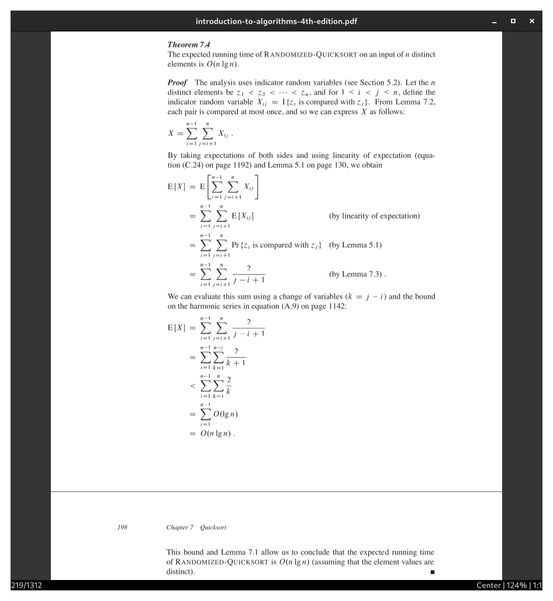

# jumpdf

Jumpdf is a keyboard-focused PDF viewer for documents where one needs to jump between different sections of the document frequently.



## Table of Contents

- [jumpdf](#jumpdf)
  - [Table of Contents](#table-of-contents)
  - [Motivation](#motivation)
  - [Installation](#installation)
    - [Flatpak](#flatpak)
    - [Build](#build)
      - [Dependencies](#dependencies)
      - [Install](#install)
      - [Uninstall](#uninstall)
  - [Usage](#usage)
    - [Keybindings](#keybindings)
    - [Configuration](#configuration)

## Motivation

A common frustration when reading is the need to manually scroll back and forth between distant locations and references. With jumpdf, one can instead mark locations and jump between them. Unlike marks in similar PDF viewers like [sioyek](https://sioyek.info/) and [zathura](https://pwmt.org/projects/zathura/), however, marks in jumpdf move with the viewer instead of being a static record of some location, thus avoiding the need to manually reset them. In addition, marks are organized into groups, which can be switched between. Besides serving as an organizational tool to help with differentiating sets of related marks, groups can also be opened in separate windows.

For example, a proof in a textbook usually refers to a set of lemmas, theorems, definitions, etc., that are scattered throughout the book. With jumpdf, one first uses <kbd>mo2</kbd> to clone the current location into mark 2. Then, one can either scroll as usual to one of the references or use the follow link mode with <kbd>f</kbd>. Now that the reference has been read, it might, however, take a few jumps back and forth to understand how it was used in the proof. So one can repeatedly use <kbd>mn</kbd> or, more conveniently, just <kbd>,</kbd> to jump back to the previous mark. If one instead wants to view both at the same time, then one must first clone the group with <kbd>go2</kbd> and then open group 2 in a new window.

## Installation

### Flatpak

[](https://flathub.org/apps/io.github.b43NnUNF4vidFYFhpqaLWy2ANawtRbMtUXZY9Pf.jumpdf)

### Build

#### Dependencies

Build dependencies:

- `meson` (>= 1.3.0)

Required:

- `gtk4` (>= 4.14)
- `poppler-glib` (>= 24.02)
- `sqlite3` (>= 3.42)

#### Install

```sh
meson setup release --buildtype=release
meson install -C release
```

#### Uninstall

```sh
ninja uninstall -C release
```

## Usage

On the desktop, open PDF files with jumpdf or by starting jumpdf and using the file chooser. On the terminal, use the following commands:

```sh
# Open file chooser
jumpdf

# Open PDF file
jumpdf <pdf_file>

# Open multiple PDF files
jumpdf <pdf_file1> <pdf_file2> ...
```

> [!WARNING]
> If you are using Flatpak and you encounter the following error when opening a file from the terminal:
>
> ```sh
> Error opening document: No such file or directory
> ```
>
> Then you need to grant access to e.g. the home directory:
>
> ```sh
> flatpak override {--user|--system} io.github.b43NnUNF4vidFYFhpqaLWy2ANawtRbMtUXZY9Pf.jumpdf --filesystem=home:ro
> ```
>
> Alternatively, the file chooser does not require any permissions.

### Keybindings

- <kbd>\<number>\<command></kbd> (repeats \<command> \<number> times)
  - <kbd>j</kbd>, <kbd>k</kbd> (Move down, up)
  - <kbd>h</kbd>, <kbd>l</kbd> (Move left, right. Must not be in center mode)
  - <kbd>d</kbd>, <kbd>u</kbd> (Move down, up half a page)
  - <kbd>+</kbd>, <kbd>-</kbd> (Zoom in, out)
  - <kbd>n</kbd>, <kbd>N</kbd> (Goto next, previous page containing the search string)
- <kbd>0</kbd> (Reset zoom)
- <kbd>c</kbd> (Toggle center mode)
- <kbd>b</kbd> (Toggle dark mode)
- <kbd>s</kbd> (Fit horizontally to page)
- <kbd>a</kbd> (Fit vertically to page)
- <kbd>gg</kbd>, <kbd>G</kbd>, <kbd>\<number>G</kbd> (Goto first, last page, page \<number>)
- <kbd>f</kbd> (Show link numbers) + <kbd>\<number></kbd> + <kbd>Enter</kbd> (Execute link)
- <kbd>m\<1-9></kbd> (Set current mark to \<1-9>. If the mark hasn't been set, it will be set to the current cursor)
- <kbd>mn</kbd> (Switch to previous mark)
- <kbd>mc\<1-9></kbd> (Clear mark \<1-9>)
- <kbd>ms\<1-9></kbd> (Swap current mark with mark \<1-9> and switch to it)
- <kbd>mo\<1-9></kbd> (Overwrite mark \<1-9> with the current cursor and switch to it)
- <kbd>g\<1-9></kbd> (Set current group to \<1-9>. If the current mark of the group hasn't been set, it will be set to the current cursor)
- <kbd>gn</kbd> (Switch to previous group)
- <kbd>gs\<1-9></kbd> (Swap current group with group \<1-9> and switch to it)
- <kbd>go\<1-9></kbd> (Overwrite group \<1-9> with the current group and switch to it)
- <kbd>.</kbd> (Repeat last command (zoom, scroll, search or switch to previous mark or group))
- <kbd>,</kbd> (Repeat last jump command (switch to previous mark or group))
- <kbd>/</kbd>, <kbd>Esc</kbd> (Show/hide search dialog)
- <kbd>o</kbd> (Open file chooser)
- <kbd>Tab</kbd> (Toggle table of contents)
  - <kbd>j</kbd>, <kbd>k</kbd> (Move down, up)
  - <kbd>/</kbd>, <kbd>Esc</kbd> (Focus/unfocus search entry)
  - <kbd>Enter</kbd> (Goto selected page)
- <kbd>F11</kbd> (Toggle fullscreen)
- <kbd>?</kbd> (Show help dialog)

### Configuration

```sh
# Copy default configuration file
mkdir -p ~/.config/jumpdf && cp data/config.toml "$_"
# For flatpak installations
mkdir -p ~/.var/app/io.github.b43NnUNF4vidFYFhpqaLWy2ANawtRbMtUXZY9Pf.jumpdf/config/jumpdf && cp data/config.toml "$_"
```
